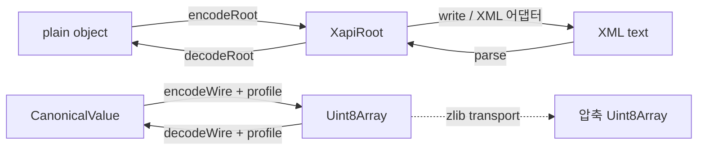

# xapi-js

Nexacro Platform과 XPlatform의 X-API 통신을 위한 TypeScript 라이브러리입니다. Dataset을 타입이 추론되는 배열로 다루고, 요청·응답 Root를 `parameters`와 `datasets`를 가진 plain object로 표현할 수 있습니다.

XML만 지원하는 단순 파서에 그치지 않고, X-API 호환 wire profile을 선택해 JSON, XML, SSV, Binary 형식으로 인코딩·디코딩할 수 있습니다. 필요하면 동일한 wire 데이터에 zlib transport 압축도 적용할 수 있습니다.

> 현재 제공되는 HTTP 어댑터(`fetch`, `express`, `nestjs`, `hono`)는 기존 호환성을 위해 XML 경로를 사용합니다. JSON·SSV·Binary 및 zlib transport는 `@xapi-js/core`의 `encodeWire`/`decodeWire` API로 직접 선택합니다.

## 주요 기능

- `xapi.operation` 기반 요청·응답 스키마와 TypeScript 타입 추론
- `INT`, `FLOAT`, `DECIMAL`, `BIGDECIMAL` 등 wire 타입 메타데이터 보존
- 기존 `XapiRoot`/`Dataset` 저수준 API 지원
- Nexacro JSON 1.0, Nexacro/XPlatform XML 4000, Nexacro/XPlatform SSV, Nexacro/XPlatform Binary 5000 지원
- `Uint8Array` 기반 인코딩·디코딩
- zlib deflate/inflate transport
- payload, Dataset, row, column, scalar, BLOB 크기 제한
- `WireCodecError`의 오류 분류와 경로 정보

## 패키지

| 패키지 | 역할 |
| --- | --- |
| `@xapi-js/core` | 스키마, Dataset, XML API, wire codec |
| `@xapi-js/adaptor-fetch` | Fetch API 클라이언트 |
| `@xapi-js/adaptor-express` | Express 미들웨어 |
| `@xapi-js/adaptor-nestjs` | NestJS interceptor |
| `@xapi-js/adaptor-hono` | Hono 핸들러 |

```bash
pnpm add @xapi-js/core
# HTTP 어댑터가 필요할 때
pnpm add @xapi-js/adaptor-fetch
pnpm add @xapi-js/adaptor-express express
pnpm add @xapi-js/adaptor-nestjs @nestjs/common rxjs
pnpm add @xapi-js/adaptor-hono hono
```

## 전체 구조

xapi-js에는 목적이 다른 두 API 계층이 있습니다.



### 1. 스키마·어댑터 계층

`xapi.operation`으로 요청과 응답의 Dataset 구조를 정의합니다. `encodeRoot`와 `decodeRoot`가 plain object와 `XapiRoot` 사이를 변환합니다. HTTP 어댑터는 이 계층을 사용해 XML 요청·응답을 처리합니다.

### 2. Wire codec 계층

`encodeWire`와 `decodeWire`는 `CanonicalValue`와 `Uint8Array` 사이를 변환합니다. `WireProfile`이 실제 코덱을 결정합니다. 이 계층은 HTTP 전송 자체를 수행하지 않으므로, Fetch·Hono 등에서 사용할 경우 직접 `Request`/`Response` body와 Content-Type을 연결해야 합니다.

두 계층은 현재 별도의 공개 API입니다. `XapiRoot`를 자동으로 `CanonicalValue`로 바꾸는 변환 함수는 제공하지 않습니다.

## 1. 타입 스키마와 operation

### 기본 스키마

```ts
import {
  InferRoot,
  RequestOf,
  ResponseOf,
  xapi,
} from "@xapi-js/core";

const searchUsers = xapi.operation({
  request: xapi.root({
    parameters: {
      service: xapi.string(),
      page: xapi.int({ optional: true }),
    },
    datasets: {
      input: xapi.dataset({
        id: xapi.int(),
        minimumBalance: xapi.bigdecimal(),
        keyword: xapi.string({ optional: true, size: 100 }),
      }),
    },
  }),
  response: xapi.root({
    parameters: {
      ErrorCode: xapi.int(),
      ErrorMsg: xapi.string({ optional: true }),
    },
    datasets: {
      users: xapi.dataset({
        id: xapi.int(),
        name: xapi.string({ size: 100 }),
        balance: xapi.bigdecimal(),
        joinedAt: xapi.datetime(),
      }),
    },
  }),
});

type SearchRequest = RequestOf<typeof searchUsers>;
type SearchResponse = ResponseOf<typeof searchUsers>;

const request: SearchRequest = {
  parameters: { service: "user.search" },
  datasets: {
    input: [{ id: 10, minimumBalance: 1000.5 }],
  },
};
```

필수 컬럼은 필수 프로퍼티가 되고, `{ optional: true }`인 컬럼은 optional 프로퍼티가 됩니다. `Dataset`은 배열로 추론됩니다.

### 지원하는 타입

| 스키마 빌더 | TypeScript 타입 | wire 타입 |
| --- | --- | --- |
| `xapi.string()` | `string` | `STRING` |
| `xapi.int()` | `number` | `INT` |
| `xapi.long()` | `number` | `LONG` |
| `xapi.float()` | `number` | `FLOAT` |
| `xapi.double()` | `number` | `DOUBLE` |
| `xapi.decimal()` | `number` | `DECIMAL` |
| `xapi.bigdecimal()` / `bigDecimal()` | `number` | `BIGDECIMAL` / `BIG_DECIMAL` |
| `xapi.boolean()` | `boolean` | `BOOLEAN` |
| `xapi.date()` | `Date` | `DATE` |
| `xapi.datetime()` / `dateTime()` | `Date` | `DATETIME` / `DATE_TIME` |
| `xapi.time()` | `Date` | `TIME` |
| `xapi.blob()` | `Uint8Array` | `BLOB` |

JavaScript에서 모두 `number`로 보이는 값도 schema에 적은 wire 타입은 유지됩니다. 따라서 `DECIMAL`과 `BIGDECIMAL`을 구분해야 하는 서버와 통신할 수 있습니다.

### Root 변환

```ts
import { decodeRoot, encodeRoot } from "@xapi-js/core";

const requestRoot = encodeRoot(searchUsers.request, request);

// requestRoot는 XapiRoot입니다.
// XML 어댑터가 아닌 직접 XML을 만들 때 사용할 수 있습니다.

const decodedRequest = decodeRoot(
  searchUsers.request,
  requestRoot,
);
```

실제 응답에는 `searchUsers.response`에 맞는 Dataset이 있어야 하며, 위 예제의 마지막 호출은 변환 API의 형태를 보여주기 위한 예입니다.

행 상태가 필요한 경우 schema row에 `$rowType`, `$orgRow` 메타데이터를 사용할 수 있습니다.

```ts
const updateRequest = {
  parameters: { service: "user.update" },
  datasets: {
    input: [
      {
        id: 10,
        minimumBalance: 1200,
        $rowType: "U" as const,
        $orgRow: { id: 10, minimumBalance: 1000 },
      },
    ],
  },
};
```

## 2. operation을 HTTP 어댑터에 연결하기

### Fetch

Fetch 어댑터는 operation schema를 기준으로 요청 plain object를 XML로 직렬화하고, XML 응답을 응답 타입으로 변환합니다.

```ts
import { xapi } from "@xapi-js/core";
import { xapiFetch } from "@xapi-js/adaptor-fetch";

const operation = xapi.operation({
  request: xapi.root({
    datasets: {
      input: xapi.dataset({ id: xapi.int(), keyword: xapi.string() }),
    },
  }),
  response: xapi.root({
    datasets: {
      users: xapi.dataset({ id: xapi.int(), name: xapi.string() }),
    },
  }),
});

const response = await xapiFetch("/xapi/users", operation, {
  parameters: {},
  datasets: {
    input: [{ id: 10, keyword: "kim" }],
  },
});

response.datasets.users[0].name; // string
```

현재 `xapiFetch`의 operation overload는 XML을 사용합니다. JSON·SSV·Binary profile을 선택하려면 아래의 wire codec API와 직접 HTTP body를 연결해야 합니다.

### Express, NestJS, Hono

세 어댑터도 동일하게 operation schema를 사용합니다.

```ts
import { xapi } from "@xapi-js/core";
import { xapiExpress } from "@xapi-js/adaptor-express";

const operation = xapi.operation({
  request: xapi.root({
    datasets: { input: xapi.dataset({ id: xapi.int() }) },
  }),
  response: xapi.root({
    datasets: { output: xapi.dataset({ id: xapi.int(), label: xapi.string() }) },
  }),
});

app.use(express.text({ type: "application/xml" }));
app.post("/xapi", xapiExpress(operation, request => ({
  parameters: {},
  datasets: {
    output: request.datasets.input.map(({ id }) => ({
      id,
      label: `user-${id}`,
    })),
  },
})));
```

## 3. Wire codec 선택

### 기본 API

```ts
import {
  decodeWire,
  encodeWire,
  roundtripWire,
  type CanonicalValue,
  type WireProfile,
} from "@xapi-js/core";

const value: CanonicalValue = {
  parameters: [
    {
      id: "ErrorCode",
      type: "INT",
      state: "value",
      lexical: "0",
      index: undefined,
      wire: undefined,
    },
  ],
  datasets: [
    {
      id: "users",
      columns: [
        { id: "id", type: "INT", index: 0, size: "4" },
        { id: "name", type: "STRING", index: 1, size: "32" },
      ],
      constColumns: [],
      rows: [
        {
          type: "N",
          orgRow: null,
          values: {
            id: { state: "value", lexical: "1" },
            name: { state: "value", lexical: "alice" },
          },
        },
      ],
      saveType: undefined,
      wire: undefined,
    },
  ],
  saveType: undefined,
  wire: undefined,
};

const profile: WireProfile = "nexacro-json-1.0";
const bytes = encodeWire(value, profile);
const decoded = decodeWire(bytes, profile);
const sameFormat = roundtripWire(bytes, profile);
```

`CanonicalValue`의 `lexical`은 wire 값의 문자열 표현입니다. `BIGDECIMAL`, 날짜, BLOB처럼 표현을 잃지 않아야 하는 값은 임의로 JavaScript 숫자로 바꾸지 않고 lexical 값을 유지하는 것이 안전합니다. BLOB·FILE 값은 Base64 문자열을 사용합니다.

### 지원 profile 전체

```ts
import { wireProfiles } from "@xapi-js/core";

for (let index = 0; index < wireProfiles.length; index++) {
  const profile = wireProfiles[index];
  const encoded = encodeWire(value, profile);
  const decoded = decodeWire(encoded, profile);
  console.log(profile, encoded.byteLength, decoded.datasets.length);
}
```

| Profile | 형식 | 권장 용도 |
| --- | --- | --- |
| `nexacro-json-1.0` | Nexacro JSON 1.0 | JSON body를 요구하는 Nexacro 연동 |
| `nexacro-xml-4000` | Nexacro XML 4000 | Nexacro 기본 XML 연동 |
| `xplatform-xml-4000` | XPlatform XML 4000 | XPlatform XML 연동 |
| `nexacro-ssv` | Nexacro SSV | 텍스트 기반 고성능 Dataset 연동 |
| `xplatform-ssv` | XPlatform SSV | XPlatform SSV 연동 |
| `nexacro-binary-5000` | Nexacro Binary 5000 | 바이너리 payload를 사용하는 Nexacro 연동 |
| `xplatform-binary-5000` | XPlatform Binary 5000 | 바이너리 payload를 사용하는 XPlatform 연동 |

profile은 단순히 Content-Type 문자열이 아닙니다. 동일한 Dataset이라도 Nexacro와 XPlatform의 namespace, SSV 세부 규칙, Binary profile 버전에 따라 결과가 달라질 수 있으므로 서버 설정과 정확히 맞춰야 합니다.

## 4. 코덱별 상세 설명

### XML 코덱

profile:

- `nexacro-xml-4000`
- `xplatform-xml-4000`

XML은 사람이 읽을 수 있고 기존 X-API 서버와의 호환성이 가장 좋습니다. ColumnInfo, Parameters, Dataset rows, row status와 original row 정보를 XML 구조로 전달합니다. 두 profile은 XML namespace가 다르므로 상대 서버에 맞는 profile을 선택합니다.

```ts
const body = encodeWire(value, "nexacro-xml-4000");
const xml = new TextDecoder().decode(body);

const parsed = decodeWire(
  new TextEncoder().encode(xml),
  "nexacro-xml-4000",
);
```

XML wire decoder는 기본적으로 strict 모드이며 DTD와 external entity를 허용하지 않습니다. 외부 엔티티를 허용하는 방식으로 우회하지 마십시오.

기존 저수준 API를 이용하는 경우에는 `XapiRoot`와 문자열 기반 `parse`/`write`를 사용할 수도 있습니다.

```ts
import { parse, write, XapiRoot } from "@xapi-js/core";

const root = new XapiRoot();
const xmlText = write(root);
const parsedRoot = parse(xmlText);
```

### JSON 코덱

profile:

- `nexacro-json-1.0`

Nexacro JSON 형식은 `version: "1.0"`, `Parameters`, `Datasets`를 포함하는 JSON 문서입니다. `encodeWire`는 JSON 문자열을 UTF-8 `Uint8Array`로 반환합니다.

```ts
const jsonBytes = encodeWire(value, "nexacro-json-1.0");
const jsonText = new TextDecoder().decode(jsonBytes);

const decoded = decodeWire(jsonBytes, "nexacro-json-1.0");
```

숫자 값을 일반 JavaScript JSON parser의 `number`로 즉시 변환하면 큰 정수나 소수의 lexical 표현이 손실될 수 있습니다. xapi-js JSON wire decoder는 wire 타입과 lexical 값을 보존하는 방향으로 처리합니다.

### SSV 코덱

profile:

- `nexacro-ssv`
- `xplatform-ssv`

SSV(Stream Separated Values)는 일반적인 쉼표 구분 CSV가 아닙니다.

- 문서 헤더: `SSV:UTF-8`
- record separator: `U+001E` (`\\x1e`)
- unit separator: `U+001F` (`\\x1f`)
- Dataset 헤더: `Dataset:<id>`
- Column 헤더: `_RowType_`
- 상수 컬럼: `_Const_`
- row status: `N`, `I`, `U`, `D`

```ts
const ssvBytes = encodeWire(value, "nexacro-ssv");
const ssvText = new TextDecoder().decode(ssvBytes);
console.log(JSON.stringify(ssvText)); // 제어 문자를 확인하기 쉬운 출력

const decoded = decodeWire(ssvBytes, "nexacro-ssv");
```

Nexacro SSV와 XPlatform SSV는 null·empty 값 표현 등 세부 동작이 다를 수 있으므로 profile을 맞춰야 합니다. 공식 드라이버와의 호환성을 위해 `ssvUnitSeparator`, `ssvRecordSeparator` 사용자 지정 옵션은 현재 지원되지 않습니다.

### Binary 코덱

profile:

- `nexacro-binary-5000`
- `xplatform-binary-5000`

Binary 코덱은 텍스트 구분자 대신 typed binary value를 사용합니다. 멀티바이트 정수와 부동소수점은 big-endian으로 처리하며, Dataset header와 variable block을 포함합니다. 문자열은 UTF-8 길이 정보와 함께 기록되고, BLOB은 binary payload를 사용합니다.

```ts
const binaryBytes = encodeWire(value, "nexacro-binary-5000");
console.log(binaryBytes instanceof Uint8Array); // true

const decoded = decodeWire(binaryBytes, "nexacro-binary-5000");
```

Binary는 사람이 직접 확인하거나 수동 수정하기 어렵습니다. 대신 payload 크기와 파싱 비용을 줄여야 하고 상대 시스템이 정확한 Binary 5000 profile을 요구할 때 선택합니다. Binary와 SSV는 XML처럼 문자열로 변환해 전송하면 안 됩니다.

## 5. zlib compression transport

zlib는 코덱과 별도의 transport 옵션입니다. 먼저 JSON·XML·SSV·Binary 중 하나를 선택한 뒤, 결과 bytes를 deflate할지 결정합니다.

```ts
const compressed = encodeWire(value, "nexacro-json-1.0", {
  zlib: true,
});

// decodeWire는 앞의 transport marker를 보고 자동으로 inflate합니다.
const restored = decodeWire(
  compressed,
  "nexacro-json-1.0",
  { zlib: true },
);
```

인코딩된 압축 payload는 다음 두 바이트로 시작합니다.

```ts
compressed[0] === 0xff;
compressed[1] === 0xad;
```

`decodeWire`는 입력이 `0xFF 0xAD`로 시작하면 자동으로 inflate한 뒤 선택된 profile decoder에 전달합니다. 압축되지 않은 입력은 그대로 처리합니다. 따라서 decode 시에는 상대 서버가 압축 payload를 보내는지에 따라 옵션을 맞추고, encode 시에는 반드시 서버가 이 marker와 zlib transport를 지원하는지 확인해야 합니다.

예: Binary + zlib 조합

```ts
const body = encodeWire(value, "xplatform-binary-5000", { zlib: true });

await fetch("https://example.test/xapi", {
  method: "POST",
  headers: {
    "Content-Type": "application/octet-stream",
    "Content-Encoding": "xapi-zlib",
  },
  body,
});
```

`Content-Encoding` 값은 서버 계약에 따라 달라질 수 있습니다. xapi-js가 HTTP 헤더를 자동으로 정하지 않으므로 실제 서버 문서에 맞춰 설정해야 합니다.

## 6. codec 선택을 포함한 전체 처리 예제

다음 예제는 operation으로 애플리케이션 타입을 정의한 뒤, 서버 계약에 따라 wire profile을 선택하고 HTTP body를 직접 처리하는 흐름입니다.

```ts
import {
  decodeWire,
  encodeRoot,
  encodeWire,
  type CanonicalValue,
  xapi,
} from "@xapi-js/core";

const operation = xapi.operation({
  request: xapi.root({
    parameters: { service: xapi.string() },
    datasets: {
      input: xapi.dataset({
        id: xapi.int(),
        keyword: xapi.string({ size: 100 }),
      }),
    },
  }),
  response: xapi.root({
    parameters: { ErrorCode: xapi.int() },
    datasets: {
      users: xapi.dataset({
        id: xapi.int(),
        name: xapi.string({ size: 100 }),
      }),
    },
  }),
});

const requestObject = {
  parameters: { service: "user.search" },
  datasets: { input: [{ id: 10, keyword: "kim" }] },
};

// operation schema -> XapiRoot
const requestRoot = encodeRoot(operation.request, requestObject);

// wire codec API는 CanonicalValue를 입력으로 받습니다.
// requestRoot를 CanonicalValue로 바꾸는 자동 bridge는 없으므로,
// 애플리케이션에서 CanonicalValue를 만들거나 기존 wire value를 사용합니다.
const wireValue: CanonicalValue = {
  parameters: [
    { id: "service", type: "STRING", state: "value", lexical: "user.search", index: undefined, wire: undefined },
  ],
  datasets: [
    {
      id: "input",
      columns: [
        { id: "id", type: "INT", index: 0, size: "4" },
        { id: "keyword", type: "STRING", index: 1, size: "100" },
      ],
      constColumns: [],
      rows: [{
        type: "N",
        orgRow: null,
        values: {
          id: { state: "value", lexical: "10" },
          keyword: { state: "value", lexical: "kim" },
        },
      }],
      saveType: undefined,
      wire: undefined,
    },
  ],
  saveType: undefined,
  wire: undefined,
};

// 서버 계약에 따라 이 한 줄의 profile을 선택합니다.
const profile = "nexacro-ssv" as const;
const body = encodeWire(wireValue, profile, { zlib: true });

const response = await fetch("/xapi/users", {
  method: "POST",
  headers: {
    "Content-Type": "application/octet-stream",
    "Content-Encoding": "xapi-zlib",
  },
  body,
});

const responseBytes = new Uint8Array(await response.arrayBuffer());
const responseWire = decodeWire(responseBytes, profile, { zlib: true });
```

XML 어댑터를 사용할 수 있는 서버라면 더 간단한 operation 호출을 권장합니다. Binary·SSV·JSON 서버처럼 body format을 직접 선택해야 하는 경우에만 위의 wire 계층을 사용하십시오.

## 7. 옵션과 보안 제한

```ts
import type { WireCodecOptions } from "@xapi-js/core";

const options: WireCodecOptions = {
  strict: true,
  zlib: false,
  base64Whitespace: false,
  limits: {
    payloadBytes: 10 * 1024 * 1024,
    datasets: 100,
    rows: 100_000,
    columns: 1_000,
    scalarBytes: 1 * 1024 * 1024,
    blobBytes: 10 * 1024 * 1024,
  },
};
```

- `strict`: 알 수 없는 구조나 옵션을 엄격하게 처리합니다. 기본값은 `true`입니다.
- `zlib`: encode 시 deflate하고 marker를 붙입니다. decode 시 marker가 있으면 inflate합니다.
- `base64Whitespace`: Base64 값의 공백 처리 정책입니다.
- `limits.payloadBytes`: 입력 payload 최대 크기
- `limits.datasets`: Dataset 개수
- `limits.rows`: Dataset row 개수
- `limits.columns`: Dataset column과 const column 개수
- `limits.scalarBytes`: scalar lexical 값의 UTF-8 크기
- `limits.blobBytes`: BLOB·FILE의 디코딩 전 크기 제한

외부에서 받은 payload를 디코딩할 때는 limits를 지정하는 것을 권장합니다. 압축 payload를 사용하는 경우에도 압축 해제 후 실제 데이터 크기를 고려해 제한을 설정해야 합니다.

## 8. 오류 처리

```ts
import { WireCodecError, decodeWire } from "@xapi-js/core";

try {
  const value = decodeWire(inputBytes, "nexacro-json-1.0", {
    limits: { payloadBytes: 10 * 1024 * 1024 },
  });
} catch (error) {
  if (error instanceof WireCodecError) {
    console.error(error.class); // malformed-input, limit-exceeded 등
    console.error(error.path);  // 오류가 발생한 value 경로
  }
  throw error;
}
```

오류 class는 다음과 같습니다.

- `invalid-request`: 함수 인자나 옵션이 잘못됨
- `unsupported-operation`: 지원하지 않는 동작
- `unsupported-profile`: 지원하지 않는 profile
- `malformed-input`: 형식이 깨진 입력
- `invalid-value`: 값 또는 타입이 잘못됨
- `limit-exceeded`: 설정한 크기·개수 제한 초과
- `internal`: 내부 처리 오류

오류의 `path`가 제공되면 `value.datasets[0].rows[3].values.amount`처럼 문제 위치를 함께 확인할 수 있습니다.

## 9. 저수준 Dataset API

동적 컬럼 접근이 필요한 경우 기존 객체 API를 사용할 수 있습니다.

```ts
import { Dataset, XapiRoot, parse, write } from "@xapi-js/core";

const root = new XapiRoot();
const users = new Dataset("users");
users.addColumn({ id: "id", type: "INT", size: 10 });
users.addColumn({ id: "name", type: "STRING", size: 100 });

const row = users.newRow();
users.setColumn(row, "id", 1);
users.setColumn(row, "name", "Alice");
root.addDataset(users);

const xml = write(root);
const parsed = parse(xml);
console.log(parsed.getDataset("users")?.getRows().length); // 1
```

## 10. 개발

```bash
pnpm install
pnpm build
pnpm test
pnpm typecheck
```

라이선스: MIT
